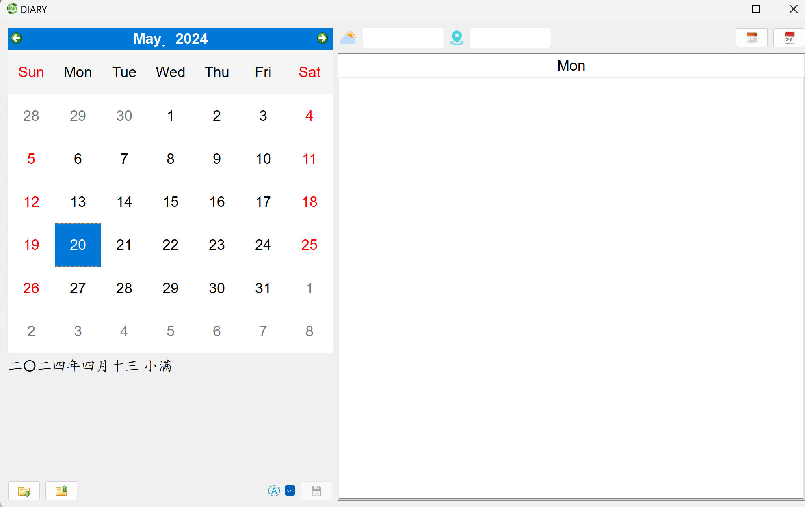

# **Diary Application**
A pure application for diary writing based on pyside6.
All data save to "diary.db" in program path and could export to excel file.
(Press Ctrl-I/Ctrl-B/Ctrl-N for fun)
You can add password now on the beginning. All string data will be encrypted with your password. Take care data would be lost if you forget your password. Of course you can still leave password empty. Press Ctrl-P in diary view to change password. You can set expiration time for login in config file (0 for never expired).



## **Build with pyinstaller**
Use your own distpath.
Build one-file mode with:
```
pyinstaller -F core\start.py -w -i style\logo.png -n Diary --add-data=".\style\*;.\style" --hidden-import=holidays.countries --exclude-module PIL --distpath "E:\Program Files\Diary"
```
or build with your own spec file:
```
pyinstaller Diary.spec -y --distpath "E:\Program Files\Diary"
```

## **Dependencies**
Developed with python 3.10.6.
```
pyside6==6.6.2
pillow==10.2.0
openpyxl=3.1.2
pyinstaller=6.4.0
holidays==0.44
sxtwl==2.0.6
```

## **Config**
Build config.ini in program path to replace default configuration, usable configurations:
```
[global]
db_name=diary.db
first_day_of_week=7
location=CN
language=zh
multi_thread=1
hide_on_startup=0
login_expired=3600

[style]
font=Arial,Kaiti
font_size=18
logo=style/logo.png
icon_interest=style/interest.png
icon_bill=style/bill.png
icon_exit=style/exit.png
icon_imp=style/imp.png
icon_exp=style/exp.png
icon_save=style/save.png
icon_add=style/add.png
icon_del=style/del.png
icon_month=style/month.png
icon_day=style/day.png
qss=style/default.qss
```